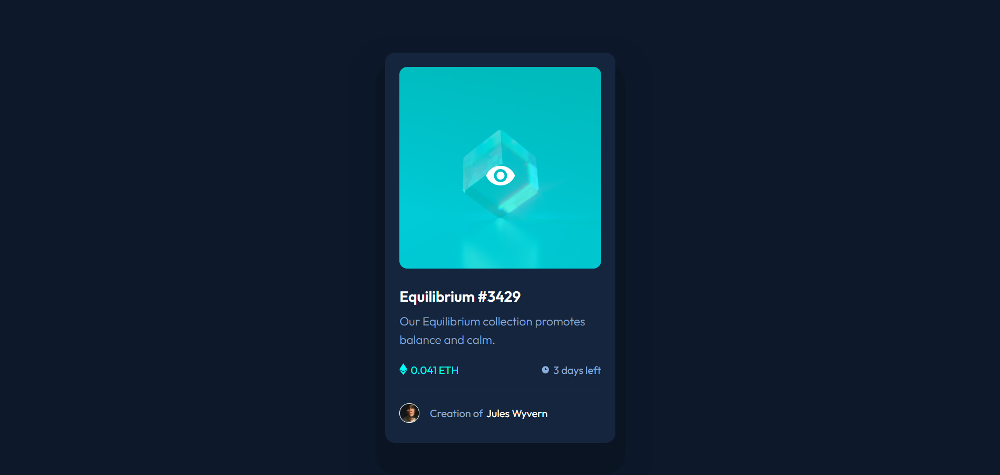

# Frontend Mentor - NFT preview card component solution

This is a solution to the [NFT preview card component challenge on Frontend Mentor](https://www.frontendmentor.io/challenges/nft-preview-card-component-SbdUL_w0U). Frontend Mentor challenges help you improve your coding skills by building realistic projects. 

## Table of contents

- [Overview](#overview)
  - [The challenge](#the-challenge)
  - [Screenshot](#screenshot)
  - [Links](#links)
- [My process](#my-process)
  - [Built with](#built-with)
  - [What I learned](#what-i-learned)
  - [Useful resources](#useful-resources)
- [Author](#author)

## Overview

### The challenge

Users should be able to:

- View the optimal layout depending on their device's screen size
- See hover states for interactive elements

### Screenshot

(./images/Frontend Mentor _ NFT.png)

### Links

- Live Site URL: [NFT Card Component](https://nostalgic-mclean-574a39.netlify.app)

## My process

Starting by sketching with pen and paper looking at the images provided by the Challenge. 

Identifiying every element to build the structure on html and the styling on css. First on mobile and then on Desktop.

### Built with

- Semantic HTML5 markup
- CSS custom properties
- Flexbox
- Mobile-first workflow

### What I learned

The use of transitions. It's a nice touch for interactivity. 

Thanks to the feedback given in Front End Mentor, I've learned more about accessibility. 

Documenting projects in an organized way, like this README :)

### Useful resources

- [Frontend Mentor Slack Community](https://www.frontendmentor.io/slack) - This helped me figuring out a tricky part of the challenge, other people were having the same problem and various suggestions and guides were given. 

## Author

- Website (Design Works) - [Karly Salama](http://karlysalama.myportfolio.com/)
- Frontend Mentor - [@Karly-Salama-M](https://www.frontendmentor.io/profile/Karly-Salama-M)

